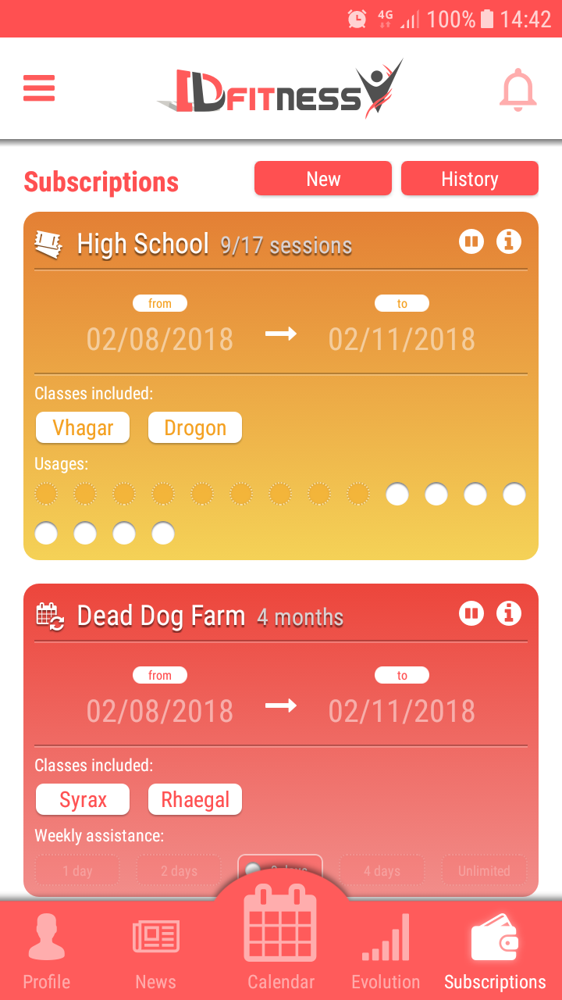
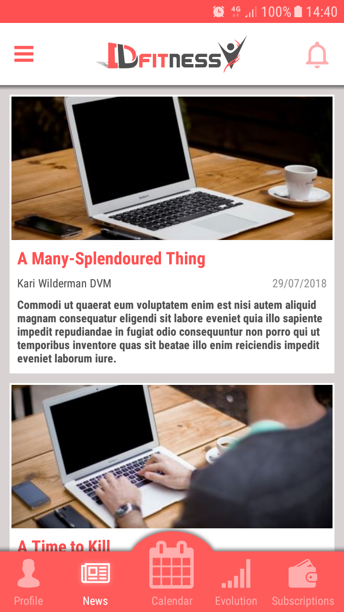

# Gyms Android Application [](https://www.linkedin.com/in/juan-albarracin-25169b131/)

> Complete project for Android

## Introduction

### About

This project is a fork of the original one with all the API calls to real services. 
With the purpose of being able to execute it, I have integrated a simulation control that generates the models in a fictitious manner.
I am currently developing the iOS part, and have finished the Android part and the services using the Spring Framework. 
Also, I have been working for several months on a prototype for the management of gyms, which includes different sections such as profile, news, evolution, subscription, nutrition, a card payment system and an component to book classes through a calendar with a specific filter system.
I have been in charge of the analysis and have developed the three above-mentioned platforms. 
To do so, I have had to meet some requirements and gather all the knowledge I have for this project:

### Libraries that I usually use

A good set of libraries makes your projects change completely in terms of functionality and readability.
While using one's own code is a great advantage for learning, it is always good to learn from others.

Libraries that are used to do this app:
* [ImagePicker](https://github.com/nguyenhoanglam/ImagePicker) – A simple library that allows you to select images from the device library or directly from the camera.
* [GlideBitmapPool](https://github.com/amitshekhariitbhu/GlideBitmapPool) – Glide Bitmap Pool is a memory management library for reusing the bitmap memory.
* [Retrofit](http://square.github.io/retrofit/) – A type-safe HTTP client for Android and Java.
* [OkhttpLoggingInterceptor](https://github.com/square/okhttp/tree/master/okhttp-logging-interceptor) – An OkHttp interceptor which logs HTTP request and response data.
* [Gson](https://github.com/google/gson) – Gson is a Java library that can be used to convert Java Objects into their JSON representation.
* [Guava](https://github.com/google/guava) – Guava is a set of core libraries that includes new collection types (such as multimap and multiset), immutable collections, a graph library, functional types, an in-memory cache, and APIs/utilities for concurrency, I/O, hashing, primitives, reflection, string processing, and much more!
* [JodaTime](http://www.joda.org/joda-time/) – Joda-Time provides a quality replacement for the Java date and time classes.
* [Lombok](https://projectlombok.org/) – Project Lombok is a java library that automatically plugs into your editor and build tools, spicing up your java.
* [ButterKnife](http://jakewharton.github.io/butterknife/) – Field and method binding for Android views. Annotate fields with @BindView and a view ID for Butter Knife to find and automatically cast the corresponding view in your layout.
* [Flexbox](https://github.com/google/flexbox-layout) – FlexboxLayout is a library project which brings the similar capabilities of CSS Flexible Box Layout Module to Android.
* [Iconify](https://github.com/JoanZapata/android-iconify) – Iconify offers you a huge collection of vector icons to choose from, and an intuitive way to add and customize them in your Android app.
* [MultiselectSpinner](https://github.com/apptik/multiselectspinner) – Multi functional and selectable spinner for Android. 
* [EventBus](https://github.com/greenrobot/EventBus) – EventBus is a publish/subscribe event bus for Android and Java.
* [JavaFaker](https://github.com/DiUS/java-faker) – This library is a port of Ruby's faker gem that generates fake data. It's useful when you're developing a new project and need some pretty data for showcase.


### Screenshots

                 

### Some examples

[Application.java](https://github.com/Lavamancer/gyms-android/blob/master/app/src/main/java/es/jalbarracinq/gyms/Application.java)

```java
public class Application extends android.app.Application {

    Session session;
    public static Application application;


    @Override
    public void onCreate() {
        super.onCreate();
        application = this;
        Session.init(this);
        Iconify.with(new FontAwesomeModule());
        RetrofitTool.getInstance();
    }

    @Override
    public void onTrimMemory(int level) {
        super.onTrimMemory(level);
        Session.store(this, session);
    }

}
```

[Session.java](https://github.com/Lavamancer/gyms-android/blob/master/app/src/main/java/es/jalbarracinq/gyms/Session.java)

```java
public class Session implements Serializable {

    private static final String SESSION_KEY = "session";

    public Login login;
    public Login autoLogin;
    public Token token;
    public List<Facility> facilities;
    public Facility facility;
    public List<LessonType> lessonTypes;
    public User user;
    public Long evolutionId;
    public List<Card> cards;
    public HashMap<Configuration.Name, String> configurations;
    public HashMap<String, Boolean> permissions;
    public boolean mock = true;


    public static Session getInstance() {
        return Application.application.session;
    }

    public static void init(Application application) {
        Session session = StorageTool.load(application, SESSION_KEY);
        if (session == null) {
            application.session = new Session();
        } else {
            application.session = session;
        }
    }

    public static void store(Application application, Session session) {
        StorageTool.store(application, session, SESSION_KEY);
    }

}
```

[Card.java](https://github.com/Lavamancer/gyms-android/blob/master/app/src/main/java/es/jalbarracinq/gyms/model/Card.java)

```java
@Data
public class Card implements Serializable {

    public enum Type { VISA, MASTER_CARD }

    private Long id;
    private String name; // alias
    private String holder;
    private String number;
    private Integer month;
    private Integer year;
    private String verification;
    private Type type;


    public Card() { }

    public Card(Faker faker, int position) {
        id = (long) position;
        name = faker.ancient().god();
        holder = faker.ancient().hero();
        number = faker.numerify("####");
        month = faker.number().numberBetween(1, 12);
        year = faker.number().numberBetween(DateTime.now().getYear(), DateTime.now().getYear() + 20);
        verification = faker.numerify("###");
        type = faker.bool().bool() ? Type.VISA : Type.MASTER_CARD;
    }

    public static List<Card> mocks(Faker faker, int count) {
        List<Card> list = new ArrayList<>();
        for (int i = 0; i < count; i++) {
            list.add(new Card(faker, i));
        }
        return list;
    }
}
```

[CustomBaseAdapter.java](https://github.com/Lavamancer/gyms-android/blob/master/app/src/main/java/es/jalbarracinq/gyms/controller/adapter/CustomBaseAdapter.java)

```java
public abstract class CustomBaseAdapter<T, VH> extends BaseAdapter {

    List<T> list;
    Activity activity;
    int itemResource;
    Class<VH> holderClass;

    public CustomBaseAdapter(Activity activity, List<T> list, int itemResource, Class<VH> holderClass) {
        this.activity = activity;
        this.list = list;
        this.itemResource = itemResource;
        this.holderClass = holderClass;
    }

    @Override
    public int getCount() {
        return list.size();
    }

    @Override
    public Object getItem(int i) {
        if (list.isEmpty()) {
            return null;
        } else {
            return list.get(i);
        }
    }

    @Override
    public long getItemId(int i) {
        return 0;
    }

    @Override
    public View getView(int i, View view, ViewGroup viewGroup) {
        VH holder = null;
        
        if (view == null) {
            view = LayoutInflater.from(activity).inflate(itemResource, viewGroup, false);
            try {
                holder = holderClass.getConstructor(View.class).newInstance(view);
            } catch (Exception e) {
                e.printStackTrace();
            }
            view.setTag(holder);
        } else {
            holder = (VH) view.getTag();
        }

        onBindViewHolder(holder, i);
        return view;
    }

    public abstract void onBindViewHolder(VH holder, int position);

}

```
[HourAdapter.java](https://github.com/Lavamancer/gyms-android/blob/master/app/src/main/java/es/jalbarracinq/gyms/controller/adapter/HourAdapter.java)

```java
public class HourAdapter extends CustomBaseAdapter<Hour, HourAdapter.HourHolder> {


    public HourAdapter(Activity activity, ArrayList<Hour> list) {
        super(activity, list, R.layout.item_hour, HourHolder.class);
    }

    public static class HourHolder {
        @BindView(R.id.houritem_relativelayout) RelativeLayout relativeLayout;
        @BindView(R.id.houritem_hour_textview) TextView hourTextView;
        @BindView(R.id.houritem_name_textview) TextView nameTextView;
        @BindView(R.id.houritem_interval_textview) TextView intervalTextView;
        @BindView(R.id.houritem_warning_imageview) ImageView warningImageView;
        @BindView(R.id.houritem_background_relativelayout) RelativeLayout backgroundRelativelayout;

        public HourHolder(View view) {
            ButterKnife.bind(this, view);
        }
    }

    @Override
    public void onBindViewHolder(HourHolder holder, int position) {
        final Hour hour = list.get(position);

        holder.relativeLayout.setOnClickListener(new View.OnClickListener() {
            @Override
            public void onClick(View view) {
                CalendarService.getLesson(activity, hour.getLesson().getId());
            }
        });

        holder.hourTextView.setText(hour.getStart().toString("HH:mm"));
        holder.nameTextView.setText(hour.getName());
        holder.intervalTextView.setText(hour.getStart().toString("HH:mm") + " - " + hour.getEnd().toString("HH:mm"));
        holder.warningImageView.setVisibility(hour.getHasEvent() ? View.VISIBLE : View.GONE);
        holder.backgroundRelativelayout.getBackground().setColorFilter(Color.parseColor(hour.getColor()), PorterDuff.Mode.SRC_ATOP);
    }
    
}
```
